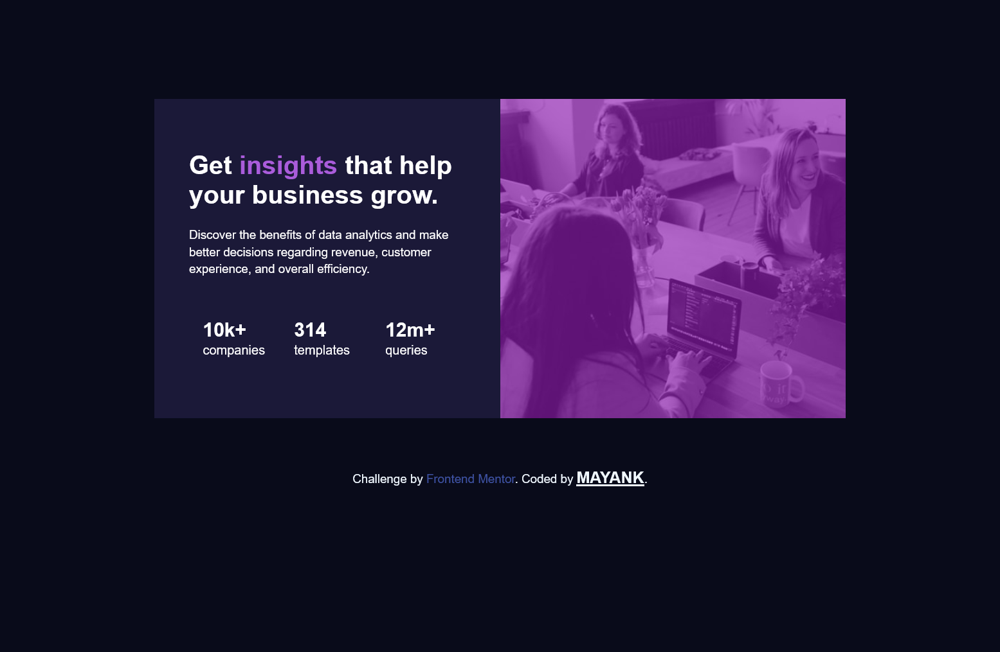

# Frontend Mentor - Stats preview card component solution

This is a solution to the [Stats preview card component challenge on Frontend Mentor](https://www.frontendmentor.io/challenges/stats-preview-card-component-8JqbgoU62). Frontend Mentor challenges help you improve your coding skills by building realistic projects.

## Table of contents

- [The challenge](#the-challenge)
- [Screenshot](#screenshot)
- [Links](#links)
- [Built with](#built-with)
- [What I learned](#what-i-learned)
- [Continued development](#continued-development)

### The challenge

Users should be able to:

- View the optimal layout depending on their device's screen size

### Screenshot

### Links

- Solution URL: [solution URL](https://github.com/Iammayank18/Responsive-card)
- Live Site URL: [live site URL](https://responsive-card-jet.vercel.app/)

### Built with

- Semantic HTML5 markup
- CSS custom properties
- CSS Grid

### What I learned

I learned , how a grid layout work for multiple devices.

### Continued development

now i will continue working on this card, with the help of react , and styled component,

## Author

- Website - [Mayank Thakur](https://responsive-card-jet.vercel.app/)
- Frontend Mentor - [@Iammayank18](https://www.frontendmentor.io/profile/Iammayank18)
- Twitter - [@mayankt34461244](https://twitter.com/mayankt34461244)
